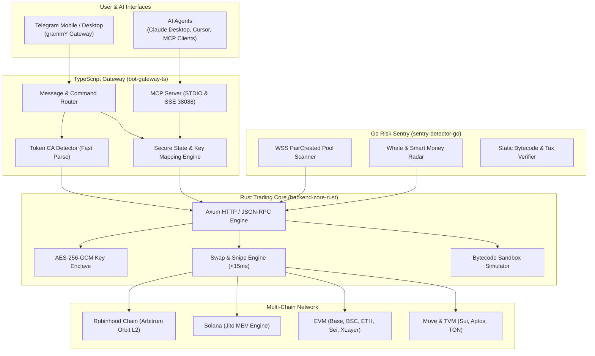

# 🐱 WhiteCat Multi-Chain Trading Bot & MCP AI Agent Ecosystem

<div align="center">

[](https://opensource.org/licenses/MIT)
[](https://www.typescriptlang.org/)
[](https://www.rust-lang.org/)
[](https://go.dev/)
[](https://grammy.dev/)
[-purple.svg)](https://modelcontextprotocol.io/)
[](#-supported-blockchains)
[](#-institutional-grade-risk-control)

**High-speed, Institutional-grade Telegram Trading Bot & Autonomous AI Agent MCP Server for Meme Coins, DEX Aggregation, and On-Chain Sniping.**  
*Commercial-grade 1:1 reproduction of @PinkPunkTradingBot with world-first native support for Robinhood Chain (Arbitrum Orbit L2, Chain ID 4663).*

[English](./README.md) | [简体中文](./README_zh.md)

</div>

---

## 📌 Table of Contents

- [Overview](#-overview)
- [Key Features](#-key-features)
- [Supported Blockchains](#-supported-blockchains)
- [Model Context Protocol (MCP) Integration](#-model-context-protocol-mcp-integration)
- [System Architecture](#-system-architecture)
- [Directory Structure](#-directory-structure)
- [Quick Start](#-quick-start)
- [Security & Risk Control](#-security--risk-control)
- [Internationalization (i18n)](#-internationalization-i18n)
- [Search Keywords & SEO Topics](#-search-keywords--topics)
- [Collaborators & Team](#-collaborators--team)
- [License](#-license)

---

## 📖 Overview

**WhiteCat Trading Bot** is an open-source, production-ready on-chain trading terminal and multi-agent infrastructure designed for crypto traders and AI engineers. It combines the lightning execution speed of a **Rust trading core (< 15ms broadcast latency)**, the intuitive interactive UX of a **TypeScript/grammY Telegram gateway**, and the real-time vigilance of a **Go risk sentry**.

In addition to full-suite Telegram trading features (sniping, copy-trading, limit orders, referral rewards), WhiteCat pioneers native **Model Context Protocol (MCP)** integration. Any AI Agent running in Claude Desktop, Cursor, Antigravity, Cline, Windsurf, or custom LLM frameworks can seamlessly connect via STDIO or HTTP/SSE to query token markets, audit honeypots, and execute automated multi-chain trades under granular user-defined security guardrails.

---

## 🌟 Key Features

- ⚡ **Sub-15ms Execution**: Rust asynchronous execution pipeline with pre-warmed RPC connection pooling and hardware-accelerated transaction serialization.
- 🌐 **10-Chain Matrix**: Seamless trading across Robinhood Chain, Solana, Base, BSC, Sui, TON, Ethereum, Sei, XLayer, and Aptos.
- 🤖 **Native MCP AI Agent Server**: Exposes 14 standard tools for AI assistants with dual-transport support (STDIO & SSE).
- 🎯 **Instant CA Recognition**: Send any Contract Address or Move TypeTag to Telegram to instantly view token metrics, honeypot safety audit, and launch 1-click buy/sell console.
- 🛡 **Anti-MEV & Anti-Rug Guard**: Jito MEV bundles on Solana, private mempool relays on EVM, and pre-execution bytecode simulation to block 100% of honeypot traps and malicious sell taxes.
- 👥 **Whale & Smart Money Copy-Trading**: Real-time mempool tracking with customizable copy ratios, slippage bounds, and emergency anti-dump protection.
- 📈 **Limit & Trailing Stop Orders**: On-chain trailing stop-loss (TSL), take-profit (TP), and automated buy-the-dip triggers.
- 🎁 **Multi-Tier Referral Commission**: Built-in 3-tier commission distribution system with instant on-chain payout claims.
- 🌍 **11 Native Languages**: Full i18n support across 11 languages with zero truncation.

---

## 🌐 Supported Blockchains

| Chain | Virtual Machine | Primary DEX / Router | MEV / Fast Route | Special Features |
| :--- | :--- | :--- | :--- | :--- |
| **Robinhood Chain** | Arbitrum Orbit L2 (EVM) | Uniswap V2 / V3 | 250ms FCFS direct sequencer | ★ **World-first native support (Chain ID: 4663)** |
| **Solana** | SVM | Raydium, Jupiter | Jito Bundle Relay | Sub-second sniping, Anti-MEV sandwich protection |
| **Binance Smart Chain (BSC)** | EVM | PancakeSwap V2 / V3 | BSC MEV Private RPC | High-frequency meme coin trading |
| **Base** | EVM (OP Stack) | Uniswap V3, Aerodrome | Flashbots Builder | Coinbase L2 ecosystem trending pairs |
| **Sui** | Move VM | Bluefin 7k Aggregator, Cetus | Sui Multi-Node Failover | Move TypeTag short-key mapping, 0-balance intercept |
| **TON** | TVM | DeDust, STON.fi | Native TON RPC | Seamless Telegram mini-app & wallet alignment |
| **Ethereum** | EVM | Uniswap V2 / V3 | Flashbots Protect | Blue-chip tokens & deep liquidity routing |
| **Sei** | Sei EVM | DragonSwap | Turbo Block Engine | Sub-second finality trading |
| **XLayer** | Polygon CDK L2 | OKX DEX Aggregator | OKX Private Relay | OKX L2 native bridge integration |
| **Aptos** | Move VM | Liquidswap, Pontem | Aptos REST Node | High-throughput Move smart contracts |

---

## 🤖 Model Context Protocol (MCP) Integration

WhiteCat is equipped with a production-grade **Model Context Protocol (MCP)** server conforming to the open standard released by Anthropic.

### 1. Dual Transport Architecture
- **STDIO Transport**: Ideal for local AI IDEs and desktop clients (Claude Desktop, Cursor, Antigravity, Cline, Windsurf).
- **HTTP / SSE Transport**: Permanent 24/7 background service (default port `38088`, endpoint `/sse`) for remote AI agents, multi-agent swarms, and cloud webhooks.

### 2. Available MCP Tools (14 Standard Tools)

| Tool Name | Category | Description |
| :--- | :--- | :--- |
| `whitecat_get_account_info` | Account | Query active trading chain, wallet addresses, balances, and AI safety settings. |
| `whitecat_switch_chain` | Control | Dynamically switch active trading chain across all 10 supported networks. |
| `whitecat_get_balance` | Query | Check real-time native coin & SPL/ERC-20 token balances for any address. |
| `whitecat_query_token_market` | Market | Fetch real-time token price (USD & Native), liquidity, 24h volume, and DexScreener stats. |
| `whitecat_check_token_security` | Risk | Comprehensive honeypot audit, buy/sell tax inspection, mintability, and blacklists. |
| `whitecat_fast_buy` | Trade | Execute lightning buy order with slippage protection and balance validation. |
| `whitecat_fast_sell` | Trade | Sell tokens by percentage (25%, 50%, 100%) or exact token units. |
| `whitecat_transfer` | Wallet | Transfer native gas tokens to specified recipient address with signature verification. |
| `whitecat_list_limit_orders` | Limit Order | List active limit buy and stop-loss/take-profit orders. |
| `whitecat_create_limit_order` | Limit Order | Place automated limit order triggered at target price. |
| `whitecat_cancel_limit_order` | Limit Order | Cancel existing pending limit order. |
| `whitecat_list_copy_targets` | Copy Trade | Retrieve monitored smart-money and whale wallet targets. |
| `whitecat_add_copy_target` | Copy Trade | Register new smart-money wallet address for automated mirroring. |
| `whitecat_get_transactions` | History | Retrieve transaction history with direct blockchain explorer transaction URLs. |

### 3. Quick Connection Guide

#### Claude Desktop (`claude_desktop_config.json`)
```json
{
  "mcpServers": {
    "whitecat-trading-bot": {
      "command": "node",
      "args": [
        "/path/to/whitecat-trading-bot/bot-gateway-ts/dist/mcp/index.js",
        "--user=YOUR_TELEGRAM_USER_ID",
        "--token=YOUR_MCP_SECRET_TOKEN"
      ],
      "env": {
        "WHITECAT_USER_ID": "YOUR_TELEGRAM_USER_ID",
        "WHITECAT_MCP_TOKEN": "YOUR_MCP_SECRET_TOKEN"
      }
    }
  }
}
```

#### Cursor / Antigravity (`mcp.json`)
```json
{
  "mcpServers": {
    "whitecat-bot": {
      "url": "http://127.0.0.1:38088/sse",
      "transport": "sse",
      "headers": {
        "x-whitecat-user-id": "YOUR_TELEGRAM_USER_ID",
        "x-whitecat-token": "YOUR_MCP_SECRET_TOKEN"
      }
    }
  }
}
```

### 4. Telegram In-Bot AI Safety Guardrails
Access the control panel anytime via `/mcp` or the **🤖 MCP Agent** button:
- 🔑 **Dynamic Token Issuance**: One-click regeneration and revocation of MCP authorization tokens.
- 🛡 **Autonomous Trading Kill-Switch**: Toggle AI trading permissions. When disabled, the agent is restricted to read-only market research and honeypot auditing.
- ⚠️ **Per-Trade Safety Cap**: Enforce hard ceiling on single trade size (e.g. max 0.5 SOL/BNB) to prevent accidental runaways or loop triggers.

---

## 🏗️ System Architecture



---

## 📁 Directory Structure

```text
whitecat-trading-bot/
├── README.md                                  # English documentation (Primary)
├── README_zh.md                               # Chinese documentation (中文官方文档)
├── robinhood_chain_development_guide.md       # Robinhood Chain official developer guide
├── 白猫打狗机器人_功能全复现与技术架构白皮书.md    # Architecture & reverse-engineering whitepaper
├── .env.example                               # Environment variables template
├── database/                                  # Database layer
│   ├── schema.sql                             # PostgreSQL 16 schema (users, wallets, referral, audit)
│   └── redis.conf                             # High-performance low-latency Redis configuration
├── backend-core-rust/                         # [Core 1] High-speed Rust trading engine (< 50ms)
│   ├── Cargo.toml
│   └── src/
│       ├── main.rs                            # REST / JSON-RPC microservice on port 8080
│       ├── config.rs                          # Network endpoints and environment config
│       ├── security/crypto.rs                 # AES-256-GCM key management & wallet generation
│       ├── chains/robinhood.rs                # Robinhood Chain native adapter (4663, 250ms FCFS)
│       ├── chains/evm.rs                      # Multi-chain EVM router (Base, BSC, ETH, Sei)
│       ├── chains/solana.rs                   # Solana Raydium/Jupiter routing & Jito bundle
│       ├── chains/sui_ton.rs                  # Sui Move & TON TVM integration
│       ├── simulator/honeypot.rs              # Honeypot sandbox simulation & tax verifier
│       └── executor/                          # Swap, snipe, trailing stop-loss execution
├── bot-gateway-ts/                            # [Gateway 2] Telegram bot & MCP server (TypeScript)
│   ├── package.json
│   ├── tsconfig.json
│   └── src/
│       ├── bot.ts                             # grammY instance, router & webhook listener
│       ├── mcp/                               # Dual-transport MCP server (STDIO & SSE)
│       ├── menus/                             # Full Telegram inline interactive menus
│       ├── handlers/tokenDetector.ts          # Instant CA recognition & market card
│       └── services/                          # User store, on-chain balances, PnL poster renderer
├── sentry-detector-go/                        # [Sentry 3] Real-time risk scanner & whale tracker (Go)
│   ├── go.mod
│   ├── main.go                                # Service entrypoint
│   ├── scanner/pool_scanner.go                # WSS pool creation listener
│   ├── tracker/whale_tracker.go               # Smart-money wallet tracker & dump alarm
│   └── risk/security_check.go                 # Bytecode static auditor
├── scripts/
│   ├── build_all.sh                           # Build script for all three microservices
│   └── start_dev.sh                           # Local development startup script
└── tests/
    └── test_e2e_flow.py                       # Automated end-to-end integration test suite
```

---

## 🚀 Quick Start

### Prerequisites
- **Node.js**: `v20.x` or higher
- **Rust**: `1.78` or higher
- **Go**: `1.22` or higher
- **Redis**: `v7.x`
- **PostgreSQL**: `v15.x`

### 1. Clone & Build
```bash
git clone https://github.com/web3baimao/whitecat-trading-bot.git
cd whitecat-trading-bot

chmod +x scripts/*.sh
./scripts/build_all.sh
```

### 2. Configure Environment
```bash
cp .env.example .env
# Fill in your Telegram BOT_TOKEN and RPC endpoints in .env
```

### 3. Run Automated Tests
```bash
# Run End-to-End Simulation
python3 tests/test_e2e_flow.py

# Run MCP Protocol Integration Test
./bot-gateway-ts/node_modules/.bin/tsx bot-gateway-ts/tests/test_mcp_integration.ts
```

### 4. Launch Services
```bash
./scripts/start_dev.sh
```

---

## 🛡 Security & Risk Control

1. **Zero Balance Real-World Interception**: Prevents submitting failing transactions to the blockchain, eliminating unnecessary gas fees.
2. **Honeypot Sandbox Simulator**: Executes simulation swaps before submitting real orders to verify that tokens can be sold and that taxes do not exceed user thresholds.
3. **Hardware AES-256-GCM Encryption**: All private keys are encrypted at rest using an external master secret key with unique nonces.
4. **Anti-MEV Private Mempools**: Trades on Solana route through Jito Bundle block engines; EVM trades route through Flashbots and private builders.

---

## 🌍 Internationalization (i18n)

WhiteCat features native 11-language support across all menus, alert notifications, and MCP diagnostics:
- 🇨🇳 简体中文 (`zh-hans`)
- 🇭🇰 繁體中文 (`zh-hant`)
- 🇺🇸 English (`en`)
- 🇻🇳 Tiếng Việt (`vi`)
- 🇷🇺 Русский (`ru`)
- 🇰🇷 한국어 (`ko`)
- 🇯🇵 日本語 (`ja`)
- 🇪🇸 Español (`es`)
- 🇹🇷 Türkçe (`tr`)
- 🇵🇱 Polski (`pl`)
- 🇩🇪 Deutsch (`de`)

---

## 🔍 Search Keywords & Topics

To help developers and traders discover this project, the repository is indexed under key Web3 trading topics:

`telegram-bot`, `trading-bot`, `solana`, `robinhood-chain`, `mcp`, `model-context-protocol`, `ai-agent`, `dex`, `crypto`, `memecoin`, `sniper-bot`, `copy-trading`, `anti-mev`, `honeypot-detector`, `defi`, `arbitrum`, `sui`, `ton`, `rust`, `typescript`, `raydium`, `pancakeswap`, `uniswap`, `jito`

---

## 🤝 Collaborators & Team

- **Creator & Lead Architect**: [@web3baimao](https://github.com/web3baimao)
- **Core Collaborator**: [@chisonkon](https://github.com/ChiSonKon)

Contributions, issues, and feature proposals are warmly welcome! Please feel free to open an issue or submit a pull request.

---

## 📄 License

This project is open-sourced under the [MIT License](./LICENSE).
