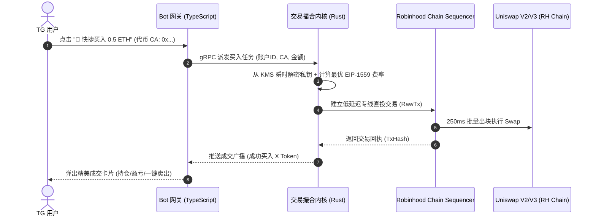

# 白猫打狗机器人 (WhiteCat Trading Bot)
## 基于 @PinkPunkTradingBot 深度逆向探查与全功能复现架构白皮书
*(附带 Robinhood Chain 原生级深度扩展)*

---

## 一、 项目定位与探查逆向综述

本项目旨在 1:1 像素级复现 Telegram 头部多链打狗机器人 **@PinkPunkTradingBot** 的全部交易、抢开盘（Snipe）、跟单（Copy Trade）、限价单（Limit Order）与风控能力，并在以下两个核心维度形成断层领先优势：

1. **多链矩阵扩展**：在原版 9 条主流公链（Ethereum, BSC, Sui, XLayer, Solana, TON / Gram, Aptos, Sei EVM, Base）的基础上，**全球首发支持 Robinhood Chain（Chain ID: 4663）与 Arc Chain（Circle Arc, Chain ID: 5042）**，抢占美股代币化（RWA）、原生 18 位 USDC 与高频 Meme 多轨红利。
2. **底层性能跃升**：采用 **Rust 原生极速撮合与打包引擎**，将链上交易打包延迟压制在 **50ms 以内**，原生集成 Jito Bundle（Solana）与 Arbitrum Nitro FCFS Sequencer（Robinhood/Base/Arbitrum），实现天然抗夹（Anti-MEV）与零滑点抢跑。

---

## 二、 @PinkPunkTradingBot 逆向探查全景拆解

通过协议层对 `@PinkPunkTradingBot` 展开的深度探测，梳理出其核心能力图谱如下：

```mermaid
graph TD
    User([Telegram 交易用户]) <--> Gateway[TG Bot 交互网关]
    Gateway <--> CoreUI[多链导航与钱包中心]
    
    subgraph 核心交易体系
        CoreUI --> FastBuy[快捷买卖 Fast Swap]
        CoreUI --> SnipeEngine[开盘狙击 Sniping Engine]
        CoreUI --> LimitDCA[限价单 / 止盈止损 / DCA]
        CoreUI --> CopyTrade[聪明钱跟单 Copy Trade]
    end

    subgraph 安全与风控
        FastBuy --> AntiMEV[Anti-MEV 私密交易路由]
        SnipeEngine --> HoneypotCheck[貔貅盘 / 权限防 Rug 检测]
    end

    subgraph 结算与裂变
        FastBuy --> FeeSplit[多级邀请返佣结算]
        FastBuy --> PnLCard[PnL 收益海报一键生成]
    end

    subgraph 多链支持矩阵 (11 大公链)
        AntiMEV --> Solana[Solana / Jito]
        AntiMEV --> EVM[Ethereum / BSC / Base / XLayer / Sei]
        AntiMEV --> MoveTON[Sui / Aptos / TON / Gram]
        AntiMEV --> RHChain[★ Robinhood 4663 & Arc 5042]
    end
```

### 1. 钱包与资产矩阵（Wallet Hub）
* **每链多钱包隔离**：单用户每条链支持绑定生成最多 10 个独立钱包（`0/10`），支持指定默认开火主钱包。
* **极速批量生成**：一键生成 BIP-44 标准助记词与派生私钥。
* **私钥导入/导出**：私钥脱敏存储，导出时需进行 Telegram 客户端二次确认防误触。
* **多钱包联合开火（Multi-Wallet Blast）**：狙击高热度土狗时，支持配置 3~5 个钱包以不同金额在同一区块同时抢跑买入。

### 2. 闪电买卖引擎（Fast Swap）
* **快捷买入挡位（Quick Buy）**：
  * EVM / Robinhood：`0.05 ETH`, `0.1 ETH`, `0.5 ETH`, `1.0 ETH`, `Custom`
  * Solana：`0.5 SOL`, `1 SOL`, `5 SOL`, `10 SOL`
* **快捷出本策略（Quick Sell）**：
  * 一键抛售：`25%`, `50%`, `100%`
  * **一键保本出本（Sell Initial）**：当持仓浮盈达到 100% 时，自动卖出等值本金部分，剩余利润持仓实现“零风险抽本”。
* **动态滑点（Dynamic Auto Slippage）**：自动根据代币当前买卖税（Tax）与流动性深度模拟最低必要滑点，防止交易回滚（Revert）。

### 3. 开盘狙击引擎（Sniping Engine）
* **流动性添加监听（Liquidity Migration Snipe）**：监听 Uniswap / Raydium 资金池注入事务。
* **方法签名狙击（MethodID Snipe）**：针对隐藏开盘、通过 `enableTrading()` 或 `openTrading()` 开启交易的代币，监听 Owner 调用的特定 4-Byte 方法签名并在下一笔紧贴买入。
* **防夹私密通道（Anti-MEV Private RPC）**：
  * EVM 链：采用 Flashbots Builder / MEV-Share 私有中继，不上公开 Mempool。
  * Solana 链：通过 Jito Searcher Client 提交 Tip Bundle，保证包含在验证节点区块最前列。
  * **Robinhood Chain**：直连 Arbitrum Orbit Sequencer 端口，利用 250ms FCFS 优先权。

### 4. 条件单与网格定投（Limit Order & DCA）
* **止盈止损（TP/SL）**：支持多梯级止盈（如 +50% 卖 30%，+100% 卖 50%，+300% 全部出清）。
* **移动追踪止损（Trailing Stop）**：价格从最高点回调 X%（如 15%）自动平仓，锁定最大利润。
* **定时定投（DCA）**：每 X 分钟买入 Y 金额，适合稳健波段用户。

### 5. 聪明钱雷达与实时跟单（Copy Trading）
* 输入目标大佬/巨鲸地址，实时监控其链上 Swap 行为。
* **防巨鲸砸盘（Anti-Dump Filter）**：巨鲸清仓时自动触发自身优先卖出。
* **跟单黑名单/过滤**：自动过滤低流动性土狗与非知名 DEX 虚假对敲交易。

### 6. 防 Rug 哨兵（Honeypot & Security Sentinel）
* **静态代码分析**：检测开源合约是否包含 `blacklist`、`mint`（增发）、`maxTxAmount`（限制交易额）、`setTaxRate`（超高买卖税）。
* **动态沙盒模拟（Simulation）**：
  * EVM / Robinhood：调用 `eth_estimateGas` 与 `eth_call` 模拟在当前区块状态买入并立即卖出 1 Token，如果回滚则直接标记为**【貔貅盘（Honeypot）】**并禁止用户下单。
  * Solana：检测 Mint Authority 与 Freeze Authority 是否已注销（Revoked），检测 LP 是否 Burn。

### 7. 病毒式裂变系统（Referral & Affiliate）
* **阶梯分佣**：邀请人享受被邀请人交易手续费（平台费通常为 1%）的 20%~40% 永久返佣。
* **即时结算大屏**：每完成一笔交易，返佣自动进入返佣账户，支持一键无缝划转至主交易钱包。

---

## 三、 技术架构与编程语言选型决策

要打造一个兼具**高并发、超低延迟、极高安全性**的打狗机器人，绝不能采用单一语言，必须实行**微服务模块化混编（Polyglot Microservices）**架构：

| 模块名称 | 职责定位 | 推荐编程语言 | 核心技术栈 / 库 | 选用理由 |
| :--- | :--- | :--- | :--- | :--- |
| **交易执行内核**<br>*(Execution Engine)* | 链上极速下单、Bundle 打包、多链路由 | **Rust** | `alloy`, `solana-client`, `jito-searcher-client`, `tokio` | 极致性能、0 内存回收（GC）停顿、原生多线程、保障 20ms 内完成签名与广播 |
| **交互与业务中心**<br>*(Bot Gateway)* | Telegram 消息路由、键盘渲染、会话管理 | **TypeScript / Node.js** 或 **Go** | `grammY` (TS) 或 `telebot` (Go), `Fastify` | 官方生态最成熟、事件驱动、异步 I/O 极强、修改交互 UI 迭代极快 |
| **行情与风控哨兵**<br>*(Security & Quoting)* | 貔貅检测、DEX 行情流计算、聪明钱监听 | **Go** / **Python** | `go-ethereum`, `web3.py`, `redis-py` | 兼顾并发网络请求与丰富的数据分析生态 |
| **高速状态总线** | 会话缓存、限频控制、交易事件分发 | **Redis 7** | Redis Pub/Sub, Redis Streams | 纳秒级响应，支撑瞬时上千人同时开枪点击 |
| **持久账本数据库** | 用户资料、资产流水、返佣账单、多链私钥映射 | **PostgreSQL 16** | `pgcrypto`, `sqlx`, `GORM` | 金融级强一致性事务（ACID），保障资产流水毫厘不差 |
| **安全密钥托管** | 私钥加密、多方解密、签名授权 | **Rust / C** | `AES-256-GCM`, `AWS KMS` / `HashiCorp Vault` | 防止服务器被渗透导致用户私钥批量泄露 |

---

## 四、 Robinhood Chain 专有功能拓展设计

针对 Robinhood Chain（Chain ID: `4663`），设计打狗专属接入方案：



1. **FCFS 纳秒级抢跑管道**：针对 Robinhood Chain 先到先得特性，Rust 核心引擎维护到 `https://rpc.mainnet.chain.robinhood.com` 的持久 HTTP/2 连接池与 WebSocket 监听，省去每次下单的 TCP/TLS 握手延迟。
2. **RWA 与 Meme 跨界闪兑**：利用 Robinhood Chain 原生流动性，支持将持仓的代币化美股（如 $NVDA 股票代币）通过链上原生对冲池一键直接换成热门 Meme 币。
3. **90天 Gas 零成本打狗计划**：集成 Robinhood 官方生态认证，符合条件的小额打狗交易自动由中继器（Relayer）代付矿工费。

---

## 五、 工程目录规范与代码架构落地

白猫打狗机器人复现项目的完整工程目录规划如下：

```text
白猫打狗机器人复现/
├── README.md                                  # 项目快速上手与环境指南
├── robinhood_chain_development_guide.md       # Robinhood 链官方开发全解
├── 白猫打狗机器人_功能全复现与技术架构白皮书.md    # 架构与逆向全书 (本文档)
├── backend-core-rust/                         # 【核心 1】Rust 极速多链交易引擎
│   ├── Cargo.toml
│   ├── src/
│   │   ├── main.rs                            # 引擎服务入口 (gRPC/IPC)
│   │   ├── chains/                            # 多链适配器
│   │   │   ├── solana.rs                      # Solana + Jito Bundle
│   │   │   ├── evm.rs                         # ETH, BSC, Base, Sei, XLayer
│   │   │   ├── robinhood.rs                   # ★ Robinhood Chain 专有适配
│   │   │   ├── sui.rs                         # Sui Move 适配
│   │   │   └── ton.rs                         # TON FunC/Tact 适配
│   │   ├── executor/                          # 买卖、狙击与防夹核心逻辑
│   │   ├── security/                          # KMS 加密与私钥隔离
│   │   └── simulator/                         # 貔貅预执行沙盒 (Honeypot Sandbox)
├── bot-gateway-ts/                            # 【核心 2】Telegram 交互前端 (TypeScript)
│   ├── package.json
│   ├── src/
│   │   ├── bot.ts                             # grammY 实例与长轮询/Webhook
│   │   ├── menus/                             # 交互菜单 (主页/钱包/买卖/跟单)
│   │   │   ├── startMenu.ts
│   │   │   ├── walletMenu.ts
│   │   │   ├── tradeMenu.ts
│   │   │   └── settingsMenu.ts
│   │   ├── handlers/                          # 消息与回调处理器
│   │   ├── services/                          # 与 Rust 引擎的 RPC 通信
│   │   └── utils/                             # 海报图生成与格式化
├── sentry-detector-go/                        # 【核心 3】风控哨兵与聪明钱雷达 (Go)
│   ├── go.mod
│   ├── main.go
│   ├── scanner/                               # 新池创建与开盘事件扫描
│   └── tracker/                               # 巨鲸钱包流动监听
└── database/                                  # 数据库迁移与数据结构
    ├── schema.sql                             # PostgreSQL 用户/钱包/账本表
    └── redis.conf                             # 高性能缓存配置
```

---

## 六、 研发推进路线图（Roadmap）

* **第一阶段（底层基石，第 1~2 周）**：
  * 完成 PostgreSQL 架构与私钥加密模块（AES-256-GCM + 硬件 Salt）。
  * 编写 Rust 多链适配器（重点打通 **Solana**、**Base** 与 **Robinhood Chain** 的 Swap 路由与签名）。
* **第二阶段（交互与基础交易，第 3~4 周）**：
  * 构建 TypeScript Telegram Bot 核心交互界面，实现 1:1 还原 PinkPunk 的全键盘菜单。
  * 打通多钱包管理（创建、导入、导出、余额实时轮询）。
  * 实现标准快捷买入（Quick Buy）与出本卖出（Quick Sell）。
* **第三阶段（高级进阶，第 5~6 周）**：
  * 接入 Solana Jito 贿赂打包与 Robinhood Chain FCFS 极速通道。
  * 交付开盘狙击（Liquidity Snipe）与貔貅盘沙盒检测（Honeypot Simulator）。
  * 上线止盈止损（TP/SL）与追踪止损（Trailing Stop）。
* **第四阶段（生态与裂变，第 7~8 周）**：
  * 交付多级分佣邀请返利系统与 PnL 收益海报实时生成。
  * 引入聪明钱自动跟单雷达与巨鲸报警系统。
  * 全链压力测试与灰度上线。
